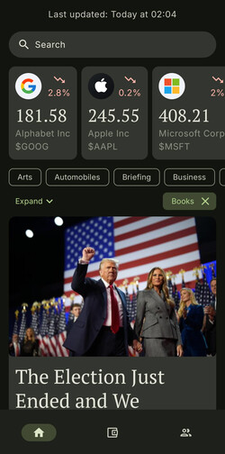
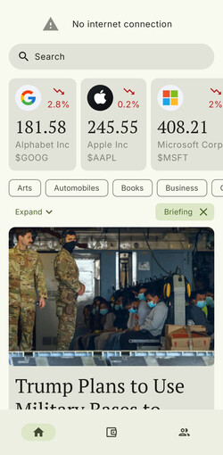
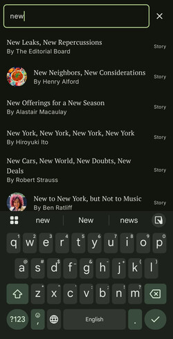
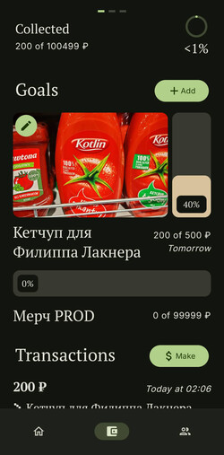
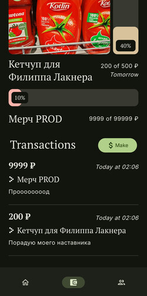

# SuperFinancer

## 🔗 Быстрые ссылки

* [Образ приложения](#-образ-приложения)
* [Базовые требования](#-базовые-требования)
* [Дополнительные фичи](#-дополнительные-фичи)
* [Документация](#-документация)
* [Контакты](#-контакты)

## ✨ Образ приложения

SuperFinancer - удобное и быстрое приложение для занятых людей. Элегантный дизайн и понятный
интерфейс отлично подойдут Т-Боссу, чьё время нельзя тратить попусту. Большая часть функционала
доступна оффлайн.

## 🔧 Базовые требования

> Все фичи, вкладки и сценарии реализованы. Ниже немного текста, больше скриншоты. Если лень
> смотреть, можете промотать сразу к [доп. фичам](#-дополнительные-фичи)

<details>
    <summary> <h4> BFR 1/2 – ✅ </h4> </summary>
    Весь функционал реализован. Дизайн система - Material3 с кастомной темой. Шрифтовая пара - PT Serif / Inter.
    
    
    
</details>

<details>
    <summary> <h4> BFR 3/4 – ✅ </h4> </summary>
    Чтобы зарегистрировать модуль поиска достаточно имплементировать интерфейс SearchAdapter и указать его в списке адаптеров. 
    WebView реализован и доступен везде, где есть ссылка на статью.
    
    
</details>

<details>
    <summary> <h4> BFR 5 – ✅ </h4> </summary>
    Весь функционал реализован: создание и закрытие финансовых целей, отслеживание транзакций и статистики.
    
    
</details>

<details>
    <summary> <h4> BFR 6 – ✅ </h4> </summary>
    Лента реализована: есть свёртка поста, фото, тэги. Модуль зависит только от модуля статей (что логично).
Избранное живёт отдельно и открывается по паролю.
    
    
</details>

## 🚀 Дополнительные фичи

- [x] Красивый и унифицированный Pull to Refresh на главной
- [x] Кэширование статей и секкций, доступ к ленте и фильтрам оффлайн + пагинация + инвалидация кэша
- [x] Вебсокеты для тикеров, обновление в реальном времени (да, они работают, просто из-за часового
  пояса биржа часто закрыта)
- [x] Легко расширяемый поиск (не завязан на внутреннюю архитектуру модуля)
- [x] Детальная статистика в финансовом планировщике

## 📝 Документация

### Architectural Decision Record

[ADR по ссылке](https://gitlab.prodcontest.ru/2025-final-projects-mobile/yaroslav-belozerov/-/tree/dev?ref_type=heads)

### Установка

- Добавьте переменные NYT_TOKEN, FINNHUB_TOKEN в `./secrets.properties`

Собрать приложение в режиме отладки (не рекомендуется):

```bash
./gradlew assembleDebug
```

Собрать приложение в режиме релиза:

- Создайте `./app/superfinancer.jks`
- Добавьте переменные KEYSTORE_PASSWORD, KEY_ALIAS, KEY_PASSWORD в `./secrets.properties`

```bash
./gradlew assembleRelease
```

## Структура проекта (модули и интеграция)

**app** - само приложние, включает навигацию, тему и специфичные для Android решения
**common** - компоненты, которые используются во всех модулях
**tickers** - тикеры (акции)
**finance** - финансовый планировщик
**stories** - статьи с NYT
**feed** - лента постов (заделка под соцсеть), зависит от **stories**

> Все модули выстроены так, чтобы как можно меньше зависеть друг от друга, чтобы сделать приложение
> более масштабируемым и тестируемым. Все публичные API модулей находятся в их корне. Всё остальное
> же расположено по слоям Clean Architecture (data, domain, ui) и помечено *internal*.

## 📞 Контакты

- [Telegram](https://t.me/yaabelozerov)
